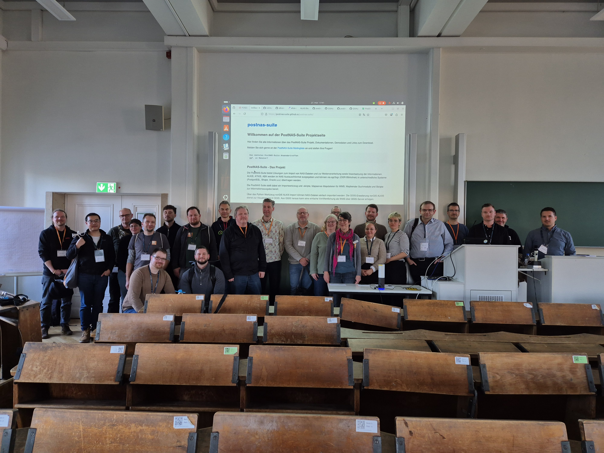

## PostNAS-Suite Anwendertreffen am Donnerstag 27.3.2025 FOSSGIS 2025 Münster

- Termin: Donnerstag 27.3.2025 FOSSGIS 2025 Münster  16:45 1. 18:00
- Ankündigung: [https://pretalx.com/fossgis2025/talk/HMFGPS/](https://pretalx.com/fossgis2025/talk/HMFGPS/)
- Einladungsmail: [https://lists.osgeo.org/pipermail/nas/2025-February/001429.html](https://lists.osgeo.org/pipermail/nas/2025-February/001429.html)
- Teilnehmer/-Innen: 27 Personen vor Ort auf der FOSSGIS, 5 Teilnehmende Online
- FOSSGIS 2025 Konferenz https://fossgis-konferenz.de/2025/

### Themen

1. Neue Repositories und Webseite des Postnas-Suite-Projektes
2. Differenzdaten
3. Stand der Daten in der Buchauskunft
4. Fehlermeldung beim Import
5. Darstellung bundesweiter ALKIS Daten
6. Lob an Jürgen Fischer
7. NRW open data
8. Energieversorger (engie) möchte im Code arbeiten
9. Probleme mit Flurstücken unterschiedlichen Alters
10. FAV Flurstückszerschneidung
11. Qualität der Grenzpunkte
 

### Protokoll 

Es waren insgesamt über 30 Personen anwesend. Dies war sicherlich ein Rekord. Viele Themen wurden diskutiert. Dennoch konnten wir nach weniger als einer Stunden das Treffen beenden, weil alle Themen besprochen wurden. 

Hervorzuheben war die zahlreiche Teilnahme von Vertretern aus dem Bereich der erneuerbaren Energien. Diese lobten den Konverter, berichteten allerdings von großem Zeitaufwand bei der Beschaffung sowie uneinheitlichen Prozessen und Daten.

Nach einer kleinen Vorstellungsrunde der Personen vor Ort, diskutierten wir die gesammelten Themen.

#### 1. Neues Repositories und Webseite des Postnas-Suite-Projektes

Die neue Webseite [1] wurde vorgestellt, es finden sich Informationen zu: 
- Komponenten
- PostNAS und Mapbender
- PostNAS und Buchauskunft
- PostNAS und MapServer
- Link zu einer Demoanwendung
- Programme
- Vorträge
- Testdaten
- Anmeldung zur Mailingliste

Die Webseite wird aus einem Repository von Github gebaut [2]

Es befinden sich im Projekt noch weitere Repositories [3]. Hier finden Sie die PHP-Infoskripte, nützliche SQLs und MapServer Mapdateien.

[1] https://postnas-suite.github.io/postnas-suite/

[2] https://github.com/postnas-suite/postnas-suite/

[3] https://github.com/orgs/postnas-suite/repositories

#### 2. Differenzdaten

Nachdem der Import des ALKIS-Import Datensatzes mit NortGIS-ALKIS-Import [4] erfolgt ist, können die Differenzdaten im NBA-Verfahren (Nutzerbezogene Bestandsdatenaktualisierung) aktualisiert werden.
Der Differenzdatensatz kann über den branch gid7 [4]  oder über den branch gid7i (inkrementell) [5] erfolgen. 
Differenzdaten im NBA-Verfahren werden nicht als Open Data zur Verfügung gestellt.

FEATURE WUNSCH: Ein Wunsch wäre es, dass man auf ein Flurstück klicken kann und dann die Historie in den Informationen ausgegeben wird.

[4] https://github.com/norBIT/alkisimport/tree/gid7

[5] https://github.com/norBIT/alkisimport/tree/gid7i

#### 3. Stand der Daten in der Buchauskunft
FEATURE WUNSCH: Bei der Buchauskunft [6] wäre es wünschenswert, den Stand der Daten auszugeben.

[6] https://github.com/postnas-suite/postnas-suite-php-info

#### 4. Fehlermeldung beim Import
Es wurde von einem Anwender angemerkt, dass bei ihm der Import abbricht.
Jürgen Fischer bat ihn, die Fehlermeldungen an die PostNAS-Mailingliste zu schicken oder ein Ticket auf github zu erstellen [7].

[7] https://github.com/norBIT/alkisimport/issues

#### 5. Darstellung bundesweiter ALKIS-Daten
Thema war ein Vortrag der FOSSGIS 2025 "Open ALKIS? – Oder was passiert, wenn der deutsche Föderalismus auf EU-Recht trifft" von Stefan Zaunseder[8].
Die Durchführungsverordnung (EU) 2023/138 (09.06.2024) besagt u.a., dass Teile des Liegenschaftskatasters als Open Data zur Verfügung stehen sollen (Gebäude, Flurstücke/Grundstücke (Katasterparzellen), Referenzparzellen und landwirtschaftliche Parzellen). 

a) Bayern ist das einzige Bundesland, dass diese Daten bisher nicht als Open Data zur Verfügung stellt.
Die AdV (Arbeitsgemeinschaft der Vermessungsverwaltungen der Länder der Bundesrepublik Deutschland) [9] wäre der richtige Ansprechpartner, um zu bemängeln, dass Bayern seine Daten nicht zur Verfügung stellt. Das BKG ist dafür nicht zuständig.
Der Vortragende Stefan Zaunseder kann ggf. Kontakt zur AdV bereitstellen.

Alternativer Import von ALKIS-Daten aus Bayern:
Über den ALKIS-WFS können einzelne Datensätze extrahiert werden.

b) Die EU hat Vorgaben zur Umsetzung der GID7 (GeoInfoDok7) gemacht ([10] und [11]). Trotz dieser Vereinheitlichungs-Verordnung haben die Bundesländer die GID7 unterschiedlich umgesetzt.

FEATURE WUNSCH: Es gibt den Wunsch, dass sich Länder zur GID7 absprechen. Lars Rosskoven fragt bei der AdV nach. 

[8] https://pretalx.com/fossgis2025/talk/TRJW9F/

[9] https://www.adv-online.de/Startseite/

[10] https://www.adv-online.de/GeoInfoDok/Aktuelle-Anwendungsschemata/

[11] https://www.adv-online.de/GeoInfoDok/Aktuelle-Anwendungsschemata/AAA-Anwendungsschema-7.1.2-Referenz-7.1/

#### 6. Lob an Jürgen Fischer

Es wurde ein Lob an Jürgen Fischer für die Umsetzung der GID7 mit dem NorGIS-ALKIS-Import-Werkzeug ausgesprochen!!!

[12] https://www.norbit.de/68/

Er gab den Hinweis, dass GID7-Daten nicht als Differenzdatensatz den GID6-Daten hinzugefügt werden können. Es ist notwendig die GID7-Daten als Erstimport neu aufzubauen.

Es gibt im Import unter postnascreate.d ein neues Script zur Transformation der Daten in ein einheitliches KBS: 1_transform.sql

#### 7. NRW Open Data
In NRW werden die Eigentümer Daten nur ohne Geometrien ausgegeben. 
Dadurch ist es schwierig, die Open-Data-Daten der Flurstücke mit den Eigentümerdaten als Auszug aus dem Grundbuch zu verknüpfen.

Daher sollte man im Katasteramt bei der Bestellung alle benötigten Daten angeben (Auszug aus dem Grundbuch mit Flurstücksgeometrien)

#### 8. Wie können Anpassungen im Code erfolgen?

Ein Anwender möchte den Quellcode bearbeiten, da er nur Flurstücke und Eigentümer benötigt und keine weiteren Informationen.

Jürgen Fischer erläutert, dass der Datenimport beim ogr2ogr-Aufruf gefiltert werden kann. Beim Import kann eine Angabe zum Layer erfolgen. 

Es ist auch möglich, die NAS-Daten so anzulegen, dass nur einzelne Tabellen erzeugt und befüllt werden.
Zu Beginn des Imports wird das Datenbank-Schema angelegt. Dieses Schema kann in den Scripten bearbeitet werden.

#### 9. Probleme mit Flurstücken unterschiedlichen Alters

Bei der Beschaffung von großen Datenmengen (größeren Gebieten, z.B. Bundesländern) können unterschiedliche Stände vorliegen (wenn open-data-Datensätze nicht an einem Tag heruntergeladen wurden).
Das kann dazu führen, dass es beim späteren Hinzufügen der Eigentümerdaten Probleme mit dem Alter der Flurstücke gibt.

#### 10. Flurstückszerschneidung (FAV)

Auf der FOSSGIS hat Oliver Schmidt (LVermGeo RLP) einen Vortrag zum Thema "Keine Angst vor der GeoInfoDok 7 - 3A-Datenverarbeitung mit PostNAS" [13] gehalten.
Die Skripte zur Flurstückszerschneidung und anderen Prozessen stehen im Repository postnas-suite-fav [12]. Er erweitert das Repository in den nächsten Wochen noch um weitere SQLs/Skripte. 

Die Repositories können auch von anderen Aktiven erweitert werden. Das kann ganz einfach über einen Pull Request stellen (Fragen dazu gerne über die Mailingliste).

Der Flurstücksabschnittsverschneider ist als Skript namens faf.pl implementiert, der die Flächenabschnitte der Flurstücke (FAF) mit der tatsächlichen Nutzung, der öffentlich-rechtlichen und sonstigen Festlegungen, der Bewertung und der Bodenschätzung berechnet. 

[13] https://pretalx.com/fossgis2025/talk/A8US8F/

[14] https://github.com/postnas-suite/postnas-suite-fav

#### 11. Qualität der Grenzpunkte
Von Oliver Schmidt wurde auch die Qualität der Grenzpunkte nachträglich bearbeitet.
Seine abgewandelten Scripte des NorGIS-ALKIS-Imports finden sich auf GitHub im Repository postnas-suite-scripts [15] siehe 9_alkispunkt_mod.sql [14].

Wenn das ALKIS Schemata in PostGIS von public abweicht, sollte der searchpath auf das korrekte Schema gesetzt werden.

[15] https://github.com/postnas-suite/postnas-suite-scripts

#### Anwendertreffen

Wann soll das nächste Treffen stattfinden? Spätestens zur nächsten FOSSGIS 2026 in Göttingen.

[https://postnas-suite.github.io/postnas-suite/postnas-suite-anwendertreffen.html](https://postnas-suite.github.io/postnas-suite/postnas-suite-anwendertreffen.html)

#### Zugriff postnas-suite Repositories
Wer gerne Zugriff auf die Webseite und die weiteren Repositories haben möchte, um Bearbeitungen durchzuführen, kann sich gerne melden.
https://github.com/postnas-suite/

### Impressionen 

